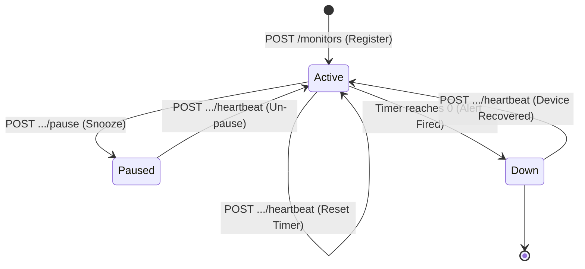

# CritMon Pulse-Check API (Watchdog Sentinel)

A Dead Man’s Switch API designed to monitor remote infrastructure. Devices register a countdown timer and must continuously send heartbeat signals. If a device fails to check in before its timer expires, the API automatically triggers an alert.

## 📐 Architecture Diagram



## 🛠️ Setup Instructions

This project requires **Python 3.8+**.

1. **Clone the repository:**
   ```bash
   git clone YOUR_GITHUB_REPO_LINK_HERE
   cd pulse-check-api
   ```

2. **Create and activate a virtual environment:**
   ```bash
   python -m venv venv
   source venv/bin/activate  # On Windows: venv\Scripts\activate
   ```

3. **Install dependencies:**
   ```bash
   pip install -r requirements.txt
   ```

4. **Run the server:**
   ```bash
   uvicorn main:app --reload
   ```
   The server will start at `http://127.0.0.1:8000`. Watch the terminal output to see the JSON alerts fire when timers expire.

## 📖 API Documentation

### 1. Register a Monitor
Creates a new countdown timer for a device.
- **URL:** `/monitors`
- **Method:** `POST`
- **Body:**
  ```json
  { "id": "device-123", "timeout": 10, "alert_email": "admin@critmon.com" }
  ```
- **Response (201 Created):** ```json
  {"message": "Monitor created for device-123. Timer started."}
  ```

### 2. Send Heartbeat (Reset)
Resets the countdown timer. If the device was paused or down, this sets it back to active.
- **URL:** `/monitors/{id}/heartbeat`
- **Method:** `POST`
- **Response (200 OK):** ```json
  {"status": "OK", "message": "Timer reset for device-123"}
  ```

### 3. Pause Monitor (Snooze)
Stops the countdown timer completely. No alerts will fire.
- **URL:** `/monitors/{id}/pause`
- **Method:** `POST`
- **Response (200 OK):** ```json
  {"status": "Paused", "message": "Monitoring paused for device-123"}
  ```

### 4. System Status Dashboard
Retrieves the real-time status and time remaining for all registered devices.
- **URL:** `/monitors`
- **Method:** `GET`
- **Response (200 OK):**
  ```json
  {
    "device-123": {
      "status": "active",
      "seconds_remaining": 5.2,
      "alert_email": "admin@critmon.com"
    }
  }
  ```

## 🚀 The Developer's Choice: Global Status Dashboard

**Added Feature:** A `GET /monitors` endpoint that returns a real-time snapshot of all devices.

**Why I added it:**
While firing an alert when a device goes down is critical, support engineers and NOC (Network Operations Center) teams need proactive visibility. By providing a dashboard endpoint, frontend applications can poll the API to display which devices are currently active, paused, or down, and precisely how many seconds remain before an alert triggers. This transforms the system from a purely reactive alarm into a comprehensive monitoring tool.